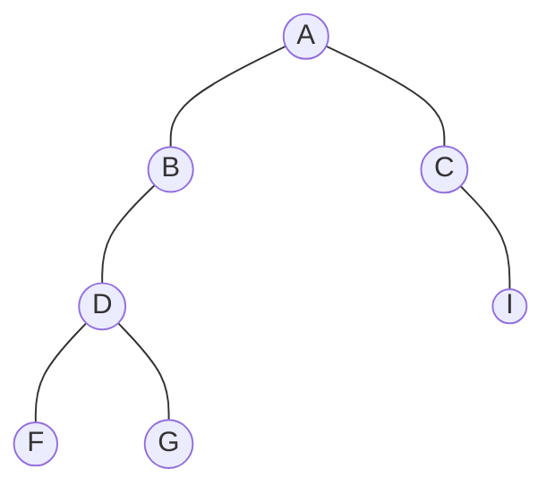

```mermaid
graph TD;
    A((A)) --- B((B));
    A --- C((C));
    B --- D((D));
    B --- E( );
    D --- F((F));
    D --- G((G));
    C --- H( );
    C --- I((I));
    linkStyle 3 stroke-width:0px;
    linkStyle 6 stroke-width:0px;
    style E opacity:0;
    style H opacity:0;
```